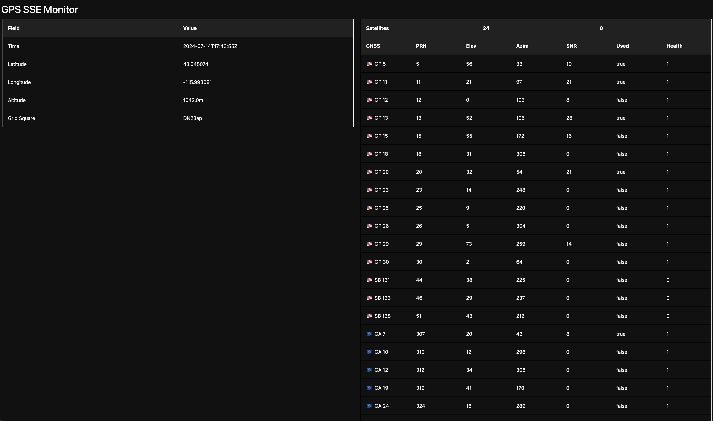

YoGoGPS
=======

## Overview

A simple web server that serves up GPSD SKY and TPV data via SSE (ServerSideEvents).

### Screenshot



### Environment variables
- `GPSD_SERVER` - The IP and port of the gpsd process. (default: `localhost:2947`)

### Commands

The simple compile and run in one:

```shell
$ go run yogogps.go
```

Or compile and then run the binary:

```shell
$ go build yogogps.go
$ ./yogogps.go
```

Note: `go install` won't work unless you then run it from the current project directory due to the required template and static files.

## Usage

Once running, navigate the running host's URL on port 8555 (e.g. http://localhost:8555) to view the gps information.

### Prometheus-style Metrics

The `/metrics` endpoint provide some basic prometheus style metrics:

* `yogogps_gps_satellites_count` - number of satellites currently received
* `yogogps_gps_lat` - currently computed latitude
* `yogogps_gps_lon` - currently computer longitude
* `yogogps_num_clients` - number of actively attached (SSE) clients viewing/using the server

## Run Tests

To run the tests:

```shell
$ go test
```

## Thanks
SSE Go example - https://gist.github.com/rikonor/e53a33c27ed64861c91a095a59f0aa44
GPSD Client for go - https://github.com/stratoberry/go-gpsd
